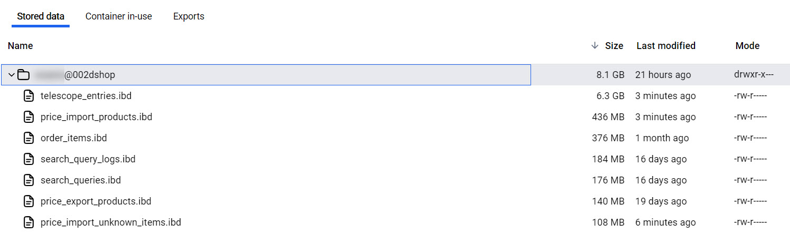

## Understanding Laravel Telescope and Its Challenges

[Laravel Telescope](https://laravel.com/docs/telescope) is a powerful debugging and monitoring tool for Laravel applications. It provides deep insights into queries, jobs, and requests, making development more efficient. However, using Telescope extensively during development or handling high-intensity jobs and queries can lead to rapid database growth.

A major problem is that the `telescope_entries` table can become bloated, sometimes reaching dozens of gigabytes.



## Laravel's Built-in Pruning and Clearing Methods

Laravel provides built-in commands to manage Telescope's database storage:

- `telescope:prune` – This command removes old entries run by scheduler.
- `telescope:clear` – This command deletes all Telescope records.

However, `telescope:clear` has several downsides:

### Performance Issues with `telescope:clear`

The `telescope:clear` command executes a `DELETE` statement on the `telescope_entries` table, which can take extremely long time if the table is large. Here's the internal implementation of the command:

```php
public function clear()
{
    do {
        $deleted = $this->table('telescope_entries')->take($this->chunkSize)->delete();
    } while ($deleted !== 0);

    do {
        $deleted = $this->table('telescope_monitoring')->take($this->chunkSize)->delete();
    } while ($deleted !== 0);
}
```

### MySQL Storage Retention Issue

Even after a successful `DELETE`, MySQL does not immediately release the space occupied by deleted rows. This is because InnoDB does not shrink the file size automatically, it only marks space as available for future inserts. This means that the `telescope_entries` table will continue to consume excessive storage unless manually optimized.

## Introducing Laravel-Telescope-Flusher

The [`laravel-telescope-flusher`](https://github.com/tegos/laravel-telescope-flusher) package addresses these problems by:

- **Performing fast deletions** using the `TRUNCATE` command.
- **Releasing disk space** with MySQL's `OPTIMIZE TABLE`.

### Efficient Clearing with Laravel-Telescope-Flusher

Here's the core implementation of the package:

```php
DB::getSchemaBuilder()->withoutForeignKeyConstraints(function () {
    DB::table('telescope_entries')->truncate();
    DB::table('telescope_entries_tags')->truncate();
    DB::table('telescope_monitoring')->truncate();
});

// Optimize only if using MySQL
if (DB::getDriverName() === 'mysql') {
    DB::statement('OPTIMIZE TABLE telescope_entries');
}
```

### Why This Works Better

- **Truncating Tables**: `TRUNCATE` is significantly faster than `DELETE` because it resets the table and does not generate large transaction logs.
- **Optimizing Tables**: The `OPTIMIZE TABLE` command ensures that MySQL reclaims the disk space previously occupied by deleted records.

## Conclusion

If you are experiencing large `telescope_entries` tables slowing down your development or consuming excessive storage, `laravel-telescope-flusher` is an excellent solution. It provides a quick, efficient way to manage Telescope entries without performance bottlenecks.

👉 Check out the package: [laravel-telescope-flusher](https://github.com/tegos/laravel-telescope-flusher)

