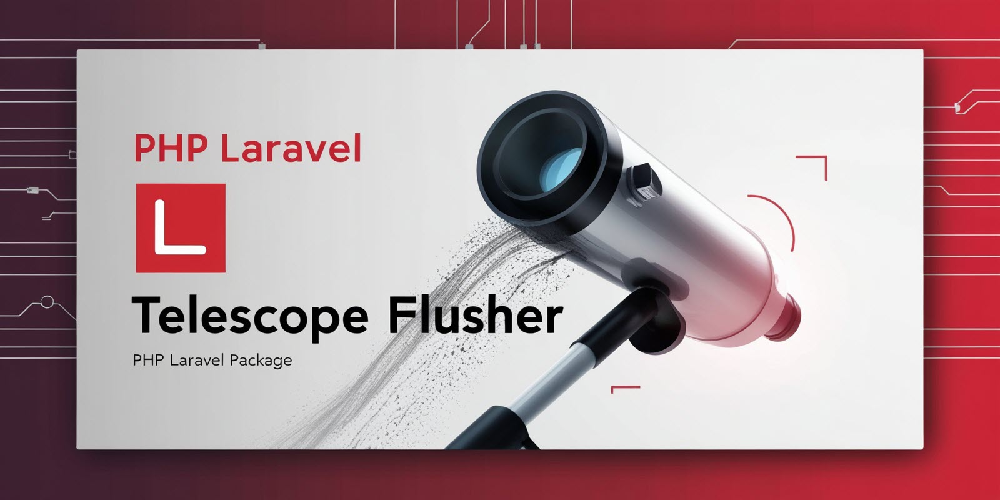

# Laravel Telescope Flusher



# Laravel-Telescope-Flusher

## Overview

[`laravel-telescope-flusher`](https://github.com/tegos/laravel-telescope-flusher) efficiently clears Laravel Telescope
entries and reclaims disk space.

## Installation

```sh
composer require tegos/laravel-telescope-flusher --dev
```

## Usage

```sh
php artisan telescope:flush
```

## Why Use It?

- **Faster Clearing:** Uses `TRUNCATE` instead of slow `DELETE`.
- **Reclaims Space:** Runs `OPTIMIZE TABLE` for MySQL.
- **Minimal Downtime:** Improves database performance.

## Learn More

Read the full article: [Efficiently Managing Telescope Entries](#)

